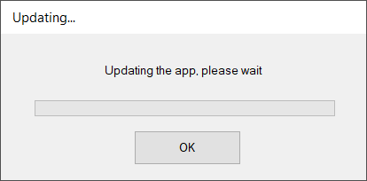

# Simple Patch Tool Extras

These projects use the dlls generated by *SimplePatchTool.sln* as reference. These dlls are automatically copied to the **lib** subdirectory via *Build Events* after a successful build of the SimplePatchTool solution.

## SimplePatchToolConsoleApp

The console app that is used throughout the [wiki](https://github.com/yasirkula/SimplePatchTool/wiki). It depends on the SimplePatchToolCore and SimplePatchToolSecurity projects.

## SelfPatcherConsoleApp

An example implementation of a console-based self patcher. It depends on the SelfPatcherCore project.

## SelfPatcherWinForms

A WinForms-based self patcher implementation. It depends on the SelfPatcherCore project.

## LauncherWinForms

A WinForms-based example launcher implementation. It depends on the SimplePatchToolCore project. You should update the values of the constants in [LauncherWindow.cs](LauncherWinForms/LauncherWindow.cs) before the launcher becomes functional. See the [wiki](https://github.com/yasirkula/SimplePatchTool/wiki/Launcher-Tutorial) for a quick tutorial.

